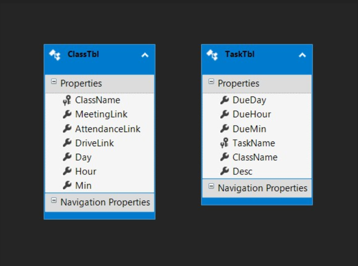
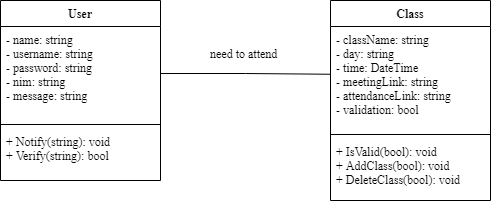

# OnlineClassManager3

Berikut adalah Diagram Database program
 

 
Terdapat 2 tabel pada pada database program ini yakni ClassTbl dan TaskTbl. ClassTbl menyimpan data kelas online yang harus dihadiri oleh mahasiswa. Data yang disimpan antara lain 
ClassName (nama mata kuliah), MeetingLink (link online class), AttendanceLink (link absen), DriveLink (link google drive mata kuliah yang dipilih), Day (Hari), Hour, dan Min (waktu kuliah dalam jam dan waktu). TaskTbl merupakan tabel yang menyimpan data-data tugas mahasiswa antara lain: DueDay, DueHour, dan DueMin untuk menyimpan hari, jam, dan menit deadline tugas, TaskName untuk menyimpan nama tugas, ClassName untuk menyimpan nama mata kuliah tugas, dan Desc untuk menyimpan penjelasan lengkap tugas yang harus dikerjakan.
 
 
Berikut adalah class diagram program 
 

 
 
Keterangan:
 
Database dengan Entity Framework sudah terkoneksi dengan program. Contoh penggunaannya adalah dengan melakukan Adding kelas (matakuliah) dan melakukan searching nama matakuliah.

